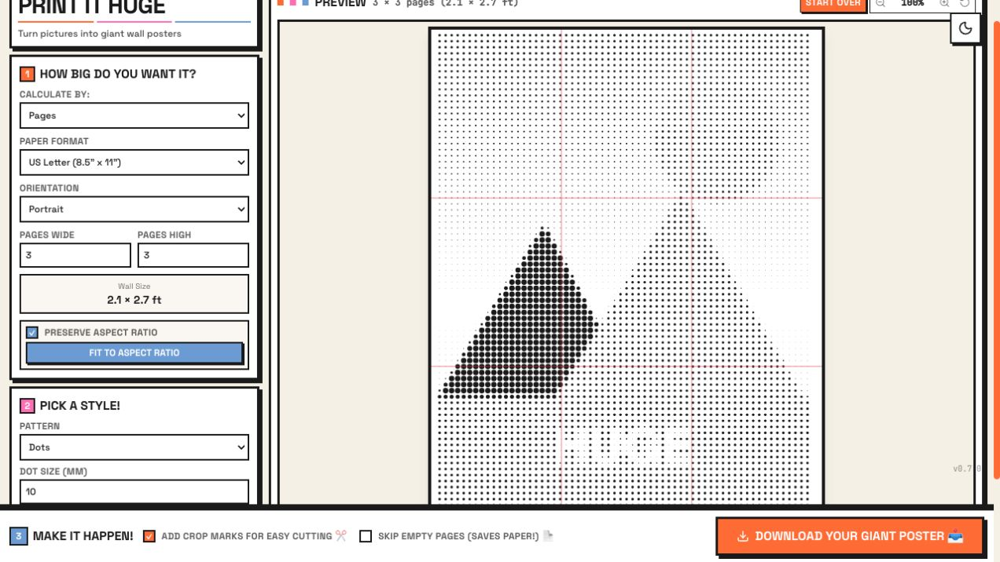

# Print It Huge

Turn any image into a giant printable wall poster using ordinary printer paper.

Print It Huge runs entirely in your browser: drop in a photo, choose how large the finished poster should be, pick a print style, and download a multi-page PDF you can trim, tile, and tape together.



## Highlights

- **Poster-sized PDFs from regular paper**: tile an image across US Letter or A4 pages.
- **Page-count or wall-size layout**: set a simple page grid, or work backward from the wall space you want to fill.
- **Print-ready guides**: optional crop marks and row/column labels make assembly easier.
- **Creative rendering styles**: dots, squares, diamonds, pixels, lines, hexagons, stippling, dither, CMYK halftone, and full-photo upscale.
- **Live preview**: see page breaks and poster scale before generating the PDF.
- **Private by design**: images stay on your computer. There is no upload step and no backend processing.
- **Built-in sample**: try the app instantly without choosing your own photo.

## How It Works

1. Drop in an image, browse for one, or use the sample poster.
2. Choose paper size, orientation, and poster dimensions.
3. Pick a visual style and tune dot size, angle, color, or color mode.
4. Download the generated PDF.
5. Print at 100% scale, trim on the crop marks, and assemble the pages.

## Sample Poster

Want to see the output before running the app? Download the [sample poster PDF](docs/print-it-huge-sample-poster.pdf). It is a 15-page letter-size poster generated by Print It Huge.

When printing, choose **actual size** or **100% scale**. Avoid "fit to page" so the tiles line up correctly.

## Run Locally

Prerequisite: Node.js 20 or newer.

```bash
npm install
npm run dev
```

Open [http://localhost:5173](http://localhost:5173).

## Useful Scripts

```bash
npm run dev      # Start the Vite development server
npm run build    # Create a production build in dist/
npm run preview  # Preview the production build
npm run lint     # Type-check the project
```

## Tech Stack

- React 19
- Vite
- TypeScript
- Tailwind CSS
- jsPDF
- lucide-react

## Privacy

Print It Huge processes images with browser APIs and generates the PDF locally. Your photo is not sent to a server by this app.

## License

MIT
